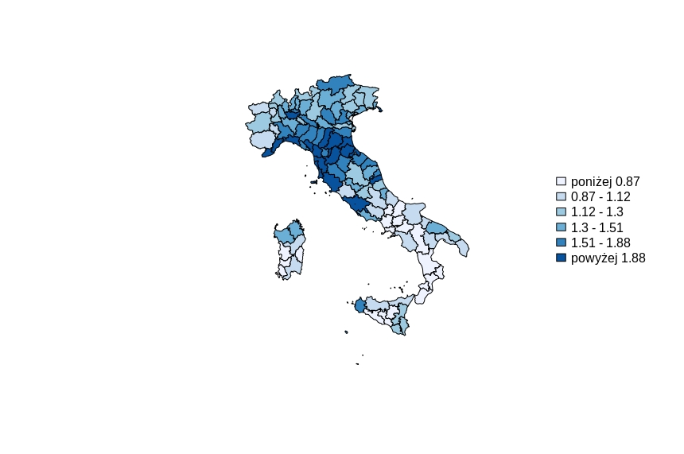
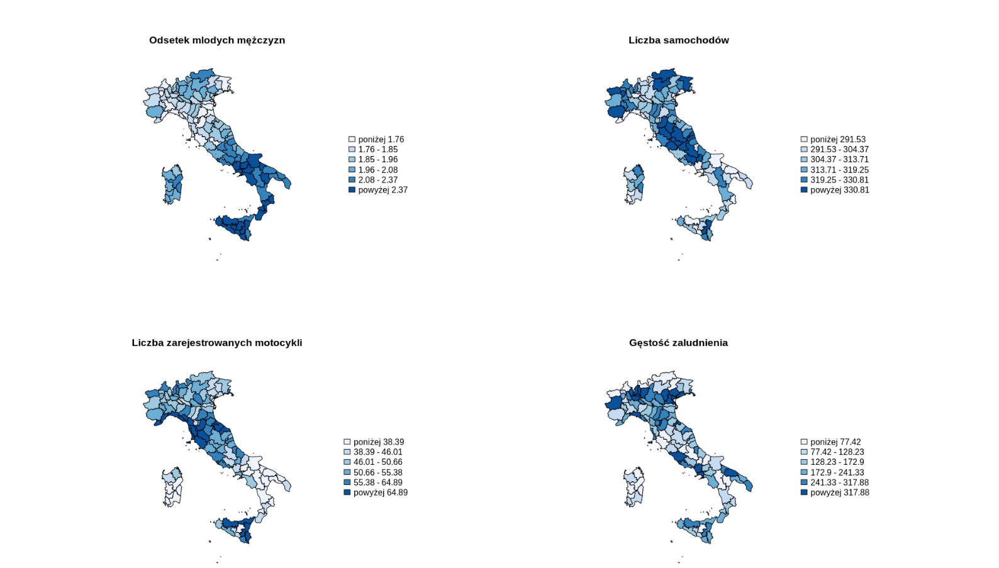

# Spatial Modelling of Traffic Accidents in Italy

This project focuses on spatial modeling of road safety in Italy based on the number of accidents that occur on public roads, residential areas, and traffic zones. The study examines the impact of various factors such as the involvement of young male drivers (aged 18-24), population density, and the number of vehicles per capita on the number of road accidents. The research identifies spatial phenomena that affect the number of accidents in different provinces in Italy. The best results were obtained through the use of a Spatial Durbin Model (SDM) built using a neighboring matrix based on the inverse square distance between centroids up to 200 km with a decay criterion of 2.

#### Project Requirements

For spatial modelling, generating neighbourhood matrix W and visualising data on maps, you will need to have the following R packages installed:

- spdep
- maptools
- rgdal
- RColorBrewer
- classInt
- dplyr
- tidyr
- geospacom

#### Data Requirements

In addition, you will need to have the following data files in your working directory:

1. NUTS_RG_01M_2013.shp: A shapefile containing the Nomenclature of Territorial Units for Statistics (NUTS) regions of Europe. Only the regions of Italy are used in this project.

2. The data used for the analysis is obtained from the Italian National Institute of Statistics (ISTAT):

   - road_accidents.csv: A CSV file containing road accident data for Italy.
   - population.csv: A CSV file containing population data for Italy.
   - vehicle_fleet.csv: A CSV file containing data on the vehicle fleet in Italy.
   - unemployment.csv: A CSV file containing unemployment data for Italy.
   - death_rate.csv: A CSV file containing data on the death rate in Italy.

#### Problem Description

The road accident statistics in Italy reveal a worrisome trend, with more then 150 000 reported accidents resulting in injuries or fatalities, as highlighted by the yearly reports. Most spatial econometric studies attribute the primary cause of road accidents to dangerous driving behavior, including speeding, failure to adhere to traffic rules, poor use of safety devices, and driving under the influence. The study pays particular attention to young drivers aged 18-24, who potentially might lack driving experience and are prone to risky behavior. Other factors that affect road accidents include traffic volume, weather conditions, and lighting.

The study's dependent variable is the number of road accidents per thousand people resulting in either death or injury. The variable is presented on a map, showing the highest concentration of accidents in the central and northwestern parts of Italy and the lowest levels in the southern part of the country.

The independent variables used in the analysis include the percentage of young male drivers (aged 18-24), the number of cars and motorcycles per thousand people, and population density. The study identifies a clear division between the northern and central-northern parts of the country, with lower levels of young male drivers, and the central-southern part of the country, where the number of young male drivers is higher.

In conclusion, the study provides valuable insights into the spatial dynamics of road accidents in Italy, emphasizing the importance of factors such as driver behavior, traffic volume, and weather conditions. The research findings could be helpful in developing effective road safety policies and programs to reduce the number of accidents and improve road safety.
